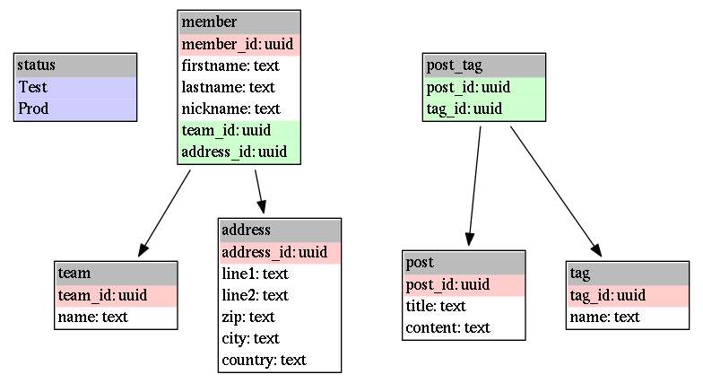

# jinx Database Tools

iDbT is a small utility designed to quickly generate SQL schemas and
associated information from a lightweight spec.

## TL;DR

`schema.yml`

```yaml
status:
  - Test
  - Prod

group:
  name: text

address:
  line1: text
  line2: text
  zip: text
  city: text
  country: text

post:
  +?title: text
  ?content: text

user:
  firstname: text
  lastname: text
  nickname: text
  ?group_id:
  address_id:

```

    jdbt ./schema.yml > schema.sql
    jdbt ./schema.yml dot | dot -Tpng -o schema.png

`schema.sql`

```sql
create type status as enum('Test', 'Prod');

create table group (
    group_id uuid primary key,
    name text not null
);

create table address (
    address_id uuid primary key,
    line1 text not null,
    line2 text not null,
    zip text not null,
    city text not null,
    country text not null
);

create table post (
    post_id uuid primary key,
    title text unique,
    content text
);

create table user (
    user_id uuid primary key,
    firstname text not null,
    lastname text not null,
    nickname text not null,
    group_id references group(group_id),
    address_id not null references address(address_id)
);
```

`schema.png`




## Input file

The input is a `yml` file describing the tables.

The following conventions are assumed:

 - every field has a `not null` constraint by default, unless it has a `?` at
   the beginning of its name
 - `+` at the beginning of a field name means it has a `unique` constraint
 - all tables have a primary key named `<table_name>_id` of type uuid
 - every column named `<something>_id` is assumed to be a foreign key

ToDo: allow the overriding of these conventions:

 - allow to define these properties explicitely
 - don't add the primary key if there is already one defined

## Output formats

### SQL

Right now only postgresql is supported. Are there any other RDBMSs out there
anyway?

### Dot

jDbT can output a file in the `dot` format, which you can compile with `dot`,
from `Graphviz`.
